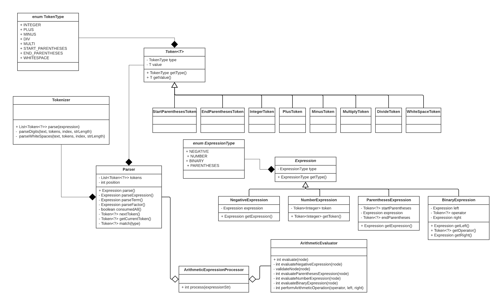

# Basic Arithmetic Compiler
## V 2.0 

### Older Version 
- [V1.0](https://github.com/hrishikesh-mishra/compiler/tree/v1.0) 

This compiler goes through various stages: 
- [Tokenization](https://github.com/hrishikesh-mishra/compiler/blob/dev/src/main/java/com/hrishikeshmishra/compiler/tokens/Tokenizer.java "Tokenization")
- [Parser (and creating Abstract Syntax Tree)](https://github.com/hrishikesh-mishra/compiler/blob/dev/src/main/java/com/hrishikeshmishra/compiler/parsers/Parser.java "Parser") 
- [Evaluator](https://github.com/hrishikesh-mishra/compiler/blob/dev/src/main/java/com/hrishikeshmishra/compiler/evaluators/ArithmeticEvaluator.java "Evaluator")


## Tokenization
It creates the tokens from given string. This is limited to following tokens: 
- Digits (Limited to integer)
- Arithmetic Operators (+, -, * and /)
- Parentheses 
- Whitespaces 
- Negative Unary operator (-)
- Variable 
- Assignment


## Parser 
This uses **Recursive Descent Parsing**. This is one the top down parse without backtracking. The reason to choose the parse is easily to understand and implement.

The arithmetic CFG which used in implementation is:  
```
    Statement -> Variable Assign Expression
    Expression -> [-] Term { PlusMinusOperation Term }
    Term ->  Factor { MultiDiv Factor }
    Factor ->  (Expression) | Number | Variable
    PlusMinusOperation  ->  + | -
    MultiDiv ->  * | /
    Number -> 0 - 9 { 0-9 }
    Variable ->  A-Z | a-z { A-Z| a-z | 0-9 }
    Assign -> =
 
    Here,
        {} -> Represent the repetition of zero more times.
        [] -> Represent optional  
```

Here, higher precedence operator goes to bottom / downward.
This parser produces the AST (abstract syntax tree).

This parser comes with some limitation: 
- Grammar, should not have Left Recursion, because program will stuck in infinite loop.
- Grammar should not be ambiguous.


## Evaluator
The evaluator traverse the AST produced by the Parser and evaluated the value. It evaluates following kinds of expression generated by parser: 
- Number Expression
- Variable Expression 
- Negative Expression 
- Parentheses Expression 
- Binary Expression 
- And Statement Expression


## Assumptions 
- Allowed binary operator: +, -, * and / and unary negative operator -.
- Limited to integer only but the result of some operation be overflow.
- Every line must be a statement with LValue and RValue, where LValue is a variable and RValue is a arithmetic expression.   
- Program will return last statement value only.
- Variable is an alphanumeric leading with letter.  
- Variable must be assigned before using it. 


## Low Level Design (LLD)


## How to run 
```shell script
#Compile with 
mvn clean install 

#Run script 
sh run.sh "<Your Arithmetic Expression >"

#Example 
sh run.sh "a=10+10*10;b=a+20"

#Output

Debugging Expression Tree:  [{"StatementExpression" : {"lValue" : "a", "rValue" :{"BinaryExpression" : {"type" : "BINARY", "left" : {"NumberExpression" : {"type" : "NUMBER", "token": "10"}}, "operator" :"+", "right" : {"BinaryExpression" : {"type" : "BINARY", "left" : {"NumberExpression" : {"type" : "NUMBER", "token": "10"}}, "operator" :"*", "right" : {"NumberExpression" : {"type" : "NUMBER", "token": "10"}}}}}}}}, {"StatementExpression" : {"lValue" : "b", "rValue" :{"BinaryExpression" : {"type" : "BINARY", "left" : {"VariableExpression": {"variable" : "a"}}, "operator" :"+", "right" : {"NumberExpression" : {"type" : "NUMBER", "token": "20"}}}}}}] 

Given expression: a=10+10*10;b=a+20
And Result = 130 
 
```

## References
- https://en.wikipedia.org/wiki/Recursive_descent_parser
- http://web.cse.ohio-state.edu/software/2231/web-sw2/extras/slides/27.Recursive-Descent-Parsing.pdf 
- https://www.engr.mun.ca/~theo/Misc/exp_parsing.htm    
- https://www.youtube.com/watch?v=N9UuAPU6DAg
- https://www.youtube.com/watch?v=SH5F-rwWEog